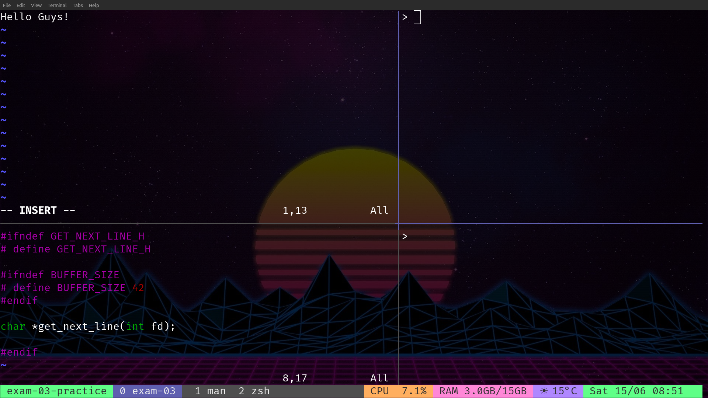

This README provides an overview of my custom Tmux configuration detailed in the `~/.tmux.conf` file. This configuration enhances Tmux with useful plugins, custom key bindings, and a Dracula theme setup.

## Preview



## Installation

1. **Install Tmux Plugin Manager (TPM):**
   ```bash
   git clone https://github.com/tmux-plugins/tpm ~/.tmux/plugins/tpm
   ```

2. **Copy the provided `~/.tmux.conf` configuration file to your home directory.**

3. **Start Tmux and press `prefix+I` (Ctrl+b, Shift+i) to install the plugins.**

## Plugin Initialization

- **Initialize TPM:**
  - Keep this line at the bottom of the configuration file: `run '~/.tmux/plugins/tpm/tpm'`

## Plugins

### Plugin Manager
- **Tmux Plugin Manager (TPM):**
  - `set -g @plugin 'tmux-plugins/tpm'`
  
### Session Management
- **Tmux Resurrect:**
  - `set -g @plugin 'tmux-plugins/tmux-resurrect'`
  - Enable automatic session save/restore: `set -g @resurrect-enable true`
  - Save session: `prefix+s`
  - Restore session: `prefix+r`

### Theme
- **Dracula Theme:**
  - `set -g @plugin 'dracula/tmux'`
  - Configure Dracula theme plugins and settings:
    - Enable plugins: `cpu-usage ram-usage weather time`
    - Disable border contrast: `set -g @dracula-border-contrast false`
    - Hide location: `set -g @dracula-show-location false`
    - Hide timezone: `set -g @dracula-show-timezone false`
    - Display day and month: `set -g @dracula-day-month true`
    - Use military time: `set -g @dracula-military-time true`
    - Hide CPU load display: `set -g @dracula-cpu-display-load false`
    - Show network interface bandwidth: `set -g @dracula-network-bandwidth-show-interface true`
    - Display session icon on the left: `set -g @dracula-show-left-icon session`
    - Use Celsius for weather: `set -g @dracula-show-fahrenheit false`
    - Set fixed location for weather: `set -g @dracula-fixed-location "Rome"`

### Plugin Colors
- **Custom Colors:**
  - CPU usage: `set -g @dracula-cpu-usage-colors "orange dark_gray"`
  - RAM usage: `set -g @dracula-ram-usage-colors "pink dark_gray"`
  - Weather: `set -g @dracula-weather-colors "light_purple dark_gray"`
  - Time: `set -g @dracula-time-colors "green dark_gray"`

## Key Bindings

- **Reload Configuration:**
  - Unbind the default `r` key.
  - Bind `r` to reload the Tmux configuration file: `source-file ~/.tmux.conf`.
  
- **Prefix Key:**
  - Set the prefix key to `Ctrl+b`.

- **Mouse Mode:**
  - Enable mouse support.

- **Vi Mode:**
  - Enable vi mode for Tmux command and copy mode.

## Pane Navigation

- **Split Windows:**
  - Vertical split: `bind '"' split-window -v -c "#{pane_current_path}"`
  - Horizontal split: `bind % split-window -h -c "#{pane_current_path}"`


Enjoy my enhanced Tmux setup!
